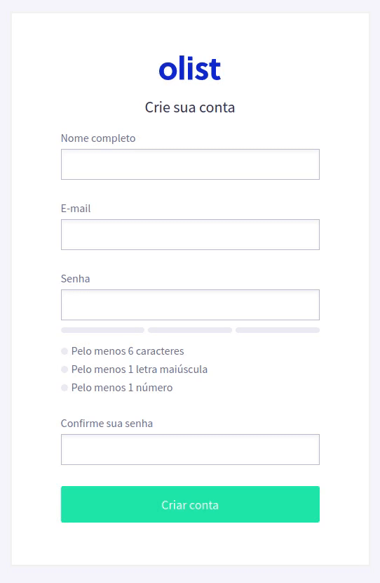
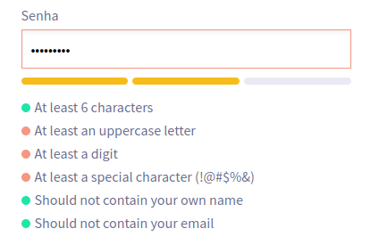
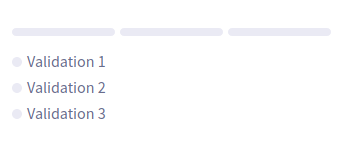
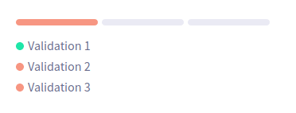
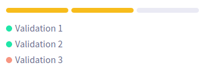
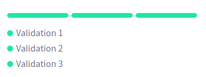

# olist front-end test

This project was bootstrapped with [Create React App](https://github.com/facebook/create-react-app)
with the following stack:

- [Typescript](https://www.typescriptlang.org/)
- [React](https://reactjs.org/)
- [Styled Components](https://styled-components.com/)
- [React Final Form](https://github.com/final-form/react-final-form)
- [@polvo-labs/form-utils](https://github.com/polvo-labs/form-utils) (developed by myself)
- [Storybook](https://storybook.js.org/)

## preview

<p style="text-align: center">
  
</p>

## setup

### requirements

- NPM or Yarn
- Node >= v10.x

### install all dependencies

NPM: `npm install`

Yarn: `yarn`

### run the project

NPM: `npm start`

Yarn: `yarn start`

### run the styleguide

NPM: `npm run storybook`

Yarn: `yarn storybook`

## `generateRules(rules: PasswordRule[])`

I've created a small function to handle the password validation. It can receive any sort and amount of validations for
your password.

```js
const { validates, isValid } = generateRules([
  {
    message: 'At least 6 characters',
    test: value => value.length >= 6
  },
  {
    message: 'At least an uppercase letter',
    test: value => /[A-Z]/g.test(value)
  },
  {
    message: 'At least a digit',
    test: value => /[0-9]/g.test(value)
  }
])
```

Both, `validates` and `isValid` accepts a string. The first returns an array of `{ message: string, passes: boolean }` for
each rule created. The latter just returns a boolean indicating if all rules were fulfilled.

```js
validates('') 
/* => [
  {
    message: 'At least 6 characters',
    passes: false
  },
  {
    message: 'At least an uppercase letter',
    passes: false
  },
  {
    message: 'At least a digit',
    passes: false
  }
]
*/

validates('ABC1')
/* => [
  {
    message: 'At least 6 characters',
    passes: false
  },
  {
    message: 'At least an uppercase letter',
    passes: true
  },
  {
    message: 'At least a digit',
    passes: true
  }
]
*/
```

```js
isValid('') // false
isValid('something') // false
isValid('ABC1') // false

isValid('aA123123') // true
```

This way, it's very easy to add or remove password rules. If you want more rules, just add them to the array:

```js
[
  {
    message: 'At least 6 characters',
    test: value => value.length >= 6
  },
  {
    message: 'At least an uppercase letter',
    test: value => /[A-Z]/g.test(value)
  },
  {
    message: 'At least a digit',
    test: value => /[0-9]/g.test(value)
  },
  {
    message: 'At least a special character (!@#$%&)',
    test: value => /[!@#$%&]/g.test(value)
  },
  {
    message: 'Should not contain your own name',
    test: value => value.indexOf(formValues['name']) === -1
  },
  {
    message: 'Should not contain your email',
    test: value => value.indexOf(formValues['email']) === -1
  }
]
```

And that's how the `<PasswordStrength />` component would looks like with the rules above:



## `<PasswordStrength />`

The `<PasswordStrength />` component is only visual and don't hold any logic for password validating. This is up to
the `generateRules` function.

This components just accepts two props:

- `value: string` the password value, usually hold in the form state.
- `rules: PasswordRuleResult[]` the array that `validates` returns.

And that how the code should look like:

```jsx
const { validates, isValid } = generateRules([
  {
    message: 'Pelo menos 6 caracteres',
    test: value => value.length >= 6
  },
  {
    message: 'Pelo menos 1 letra maiúscula',
    test: value => /[A-Z]/g.test(value)
  },
  {
    message: 'Pelo menos 1 número',
    test: value => /[0-9]/g.test(value)
  }
])

// ...

<PasswordStrength
  value={formValues['password']}
  rules={validates(formValues['password'])}
/>
```

### how the indicators work

1. If the given value is empty, set all light:



2. The requirements were partially fulfilled, set only the first one to red:



3. The requirements were mostly fulfilled, set the first two to yellow:



4. The requirements were fully fulfilled, set all green:


